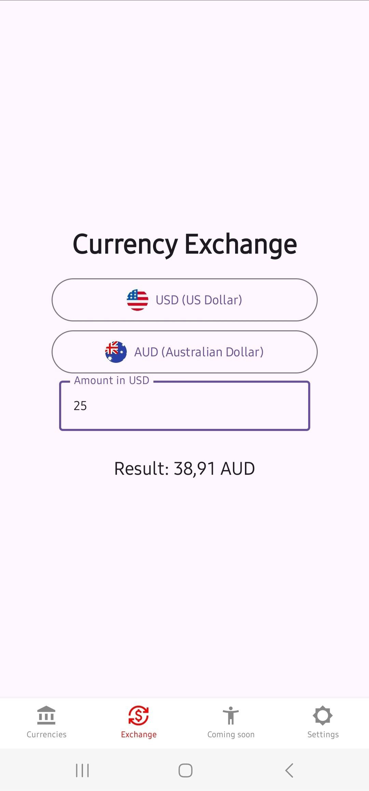
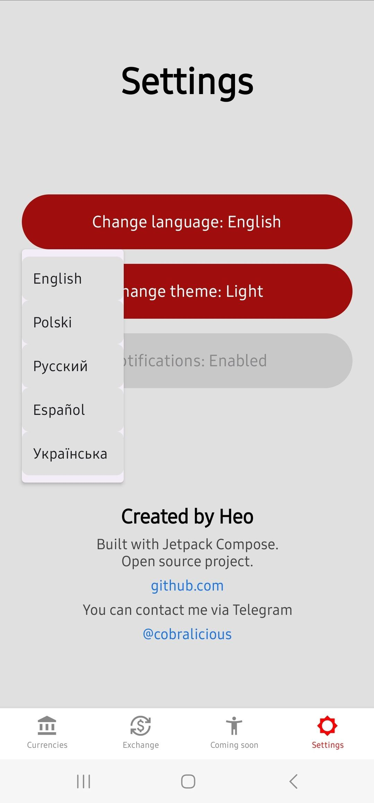

<p align="center">
  
</p>

<p align="center">
  
</p>

<h2 align="center">💱 FluxRate</h2>

<p align="center"><i>Your personal currency exchange</i></p>

<p align="center"><b>⚡ Fast</b> ・ <b>🎯 Clean</b> ・ <b>🚫 No BS</b></p>

---

## 📲 About

**FluxRate** is a sleek and intuitive Android app built with Jetpack Compose that allows you to convert between currencies in real time using live exchange rates. Perfect for travelers, traders, and the curious.

## 🚀 Features

- 🌍 Real-time currency rates (via API)
- 💱 Exchange calculator between 20+ world currencies
- 🇺🇸 Flags for visual clarity
- 🔥 Built with Jetpack Compose
- 📦 Lightweight and fast

## 🖼️ Screenshots

<p align="center">
  
  
  
</p>

## 📦 APK

Want to try it now?

👉 [**Download FluxRate.apk**](./FluxRate.apk)

Just install it on your Android device and you're good to go.

## 🛠️ Tech Stack

- Kotlin
- Jetpack Compose
- Retrofit
- MVVM architecture

## 📡 API

Live exchange rates provided via [API Layer](https://apilayer.com/marketplace/currext-api).

## 📍 Installation (Development)

Clone the repo:

```bash
git clone https://github.com/yourusername/FluxRate.git
```

Open in Android Studio, build and run on emulator or device.

---

## 🙌 Contribute
Pull requests are welcome. For major changes, please open an issue first to discuss what you would like to change.

---

## 📃 License
This project is open-source and available under the MIT License.

<p align="center"> Built with ❤️ by <a href="https://github.com/cobralicious">yourusername</a> </p> 
